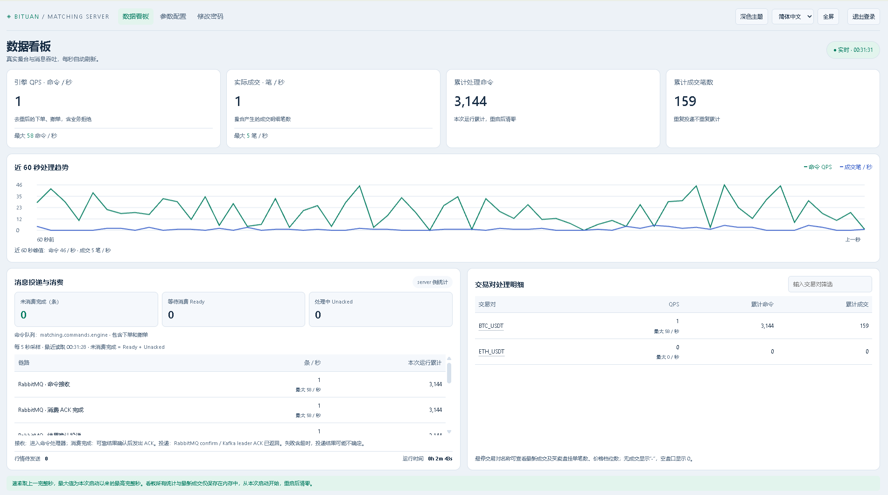
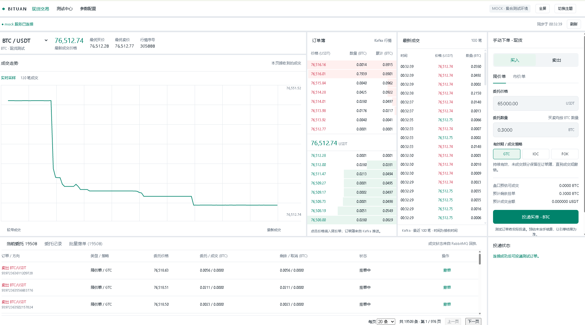
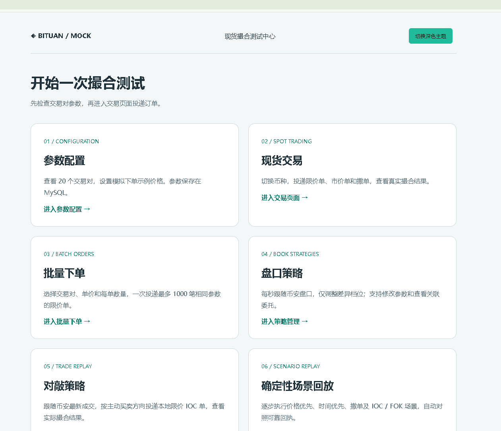
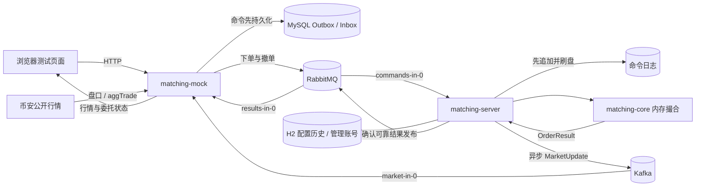
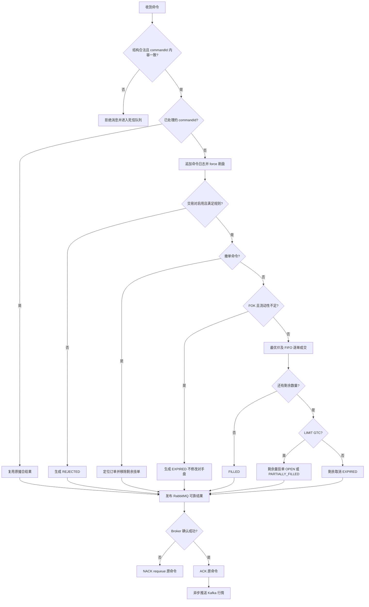
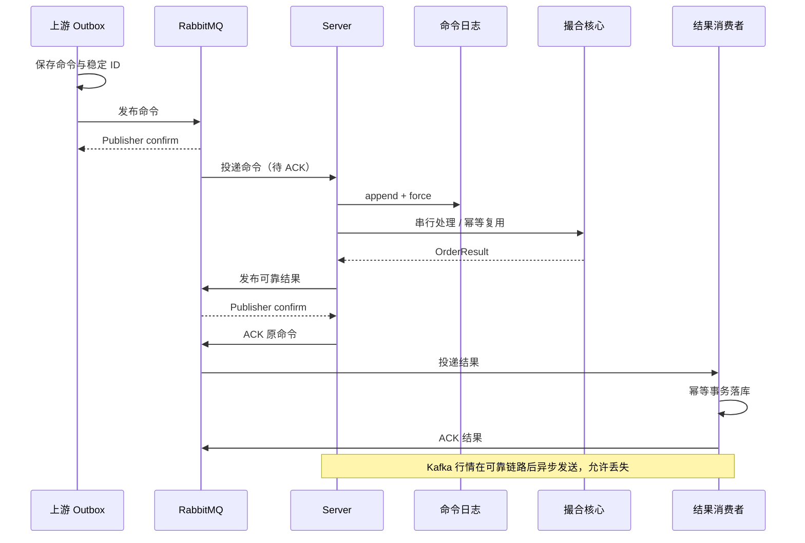

# BITUAN Spot Matching Engine · 币团现货撮合引擎

基于 **Java 25 / Spring Boot 4 / Spring Cloud Stream** 的现货撮合引擎，包含内存订单簿、可靠消息处理、日志恢复、管理看板与可交互的撮合测试中心。

> 我曾担任一家准二线交易所的 CTO。目前，我通过 AI 辅助重构了币团交易所的撮合引擎，希望把撮合规则、消息可靠性和测试过程以可阅读、可运行的代码分享出来，欢迎交流与贡献。

问题反馈：GitHub Issues，或发送邮件至 **[carter659@gmail.com](mailto:carter659@gmail.com)**。

## 项目概览

- **撮合规则**：价格优先、同价时间优先；支持 LIMIT/GTC、LIMIT/IOC、LIMIT/FOK 和 MARKET/IOC。
- **订单簿**：每个交易对独立维护买卖价格树、价位内 FIFO 双向链表和订单 ID 索引。
- **精度**：核心使用 `long priceTicks`、`long quantityLots`，不以浮点数进行价格和数量运算。
- **可靠通道**：RabbitMQ 承载下单、撤单、撮合结果；发布确认、手动 ACK、持久化与幂等配合使用。
- **行情通道**：Kafka 推送全量订单簿和最新成交；异步发送，允许丢失，通过周期快照刷新盘口。
- **恢复机制**：命令先落日志，再修改内存；启动时按命令与配置历史顺序回放。
- **管理后台**：交易对启停及数量限制、QPS、成交统计、消息队列积压、登录和密码修改、主题与语言切换。
- **测试中心**：手工下单、批量下单/撤单、分页委托、币安盘口跟随、成交跟随、循环触价扫档、确定性场景回放。

当前实现是一个可运行的撮合与接入验证项目。它没有实现完整交易所的账户余额、资产冻结、清算、手续费、用户权限和风控体系；截图中的统计值是运行样例，不代表性能基准。

## 页面预览

截图位于仓库的 `images/` 目录。

### 引擎管理看板



### 现货交易测试终端



### 撮合测试中心



## 模块划分

| 模块 | 职责 |
| --- | --- |
| `matching-core` | 撮合算法、订单簿、引擎参数；不依赖消息中间件执行核心撮合 |
| `matching-protocol` | 下单/撤单命令、撮合结果、成交与盘口消息模型 |
| `matching-persistence` | 带校验的追加日志、快照归档与读取 |
| `matching-server` | RabbitMQ 命令消费、可靠处理、Kafka 行情发送、管理后台与配置 |
| `matching-mock` | 订单生成、RabbitMQ 结果落库、Kafka 行情消费、测试页面及策略 |

所有应用启动类命名为 `App`，父 `pom.xml` 统一管理依赖。当前配置使用 Spring Boot **4.1.1**、Spring Cloud **2025.1.3**、MyBatis Plus **3.5.17**。

## 技术实现与消息链路



浏览器不直接连接 RabbitMQ 或 Kafka。mock 提供 HTTP 接口，后端通过 Spring Cloud Stream 的 Rabbit / Kafka Binder 接入消息中间件。币安仅作为公开行情源，项目策略只向本地撮合引擎下单。

### 撮合原理

买盘按价格从高到低，卖盘按价格从低到高排列。一个价格档位内部使用 FIFO 链表，先进入引擎的订单先成交。这里的时间优先是**引擎处理顺序**，不是客户端时间戳或雪花 ID 的大小。

新订单为 taker，盘口中的订单为 maker。买单可匹配价格不高于其限价的卖单，卖单可匹配价格不低于其限价的买单。每次成交数量为双方剩余数量的较小值，成交价使用 **maker 挂单价格**。一笔大单可连续匹配同档位很多小单，也可跨多个符合限价的档位。

| 类型 / 有效方式 | 行为 |
| --- | --- |
| LIMIT + GTC | 先成交可成交部分，剩余挂入本方订单簿，等待成交或撤销 |
| LIMIT + IOC | 立即成交可成交部分，剩余取消，不挂单 |
| LIMIT + FOK | 在同一撮合锁内预检可成交总量；不足则整笔失效，不修改 maker；足够才成交 |
| MARKET + IOC | 不限制成交价，按基础币数量吃对手盘，剩余取消；协议要求 `priceTicks=0` |



更多数据结构、边界条件与恢复说明见 **[撮合引擎设计文档](docs/matching-engine.md)**。

## 快速启动

### 1. 准备依赖

- JDK **25**；项目提供 Maven Wrapper。
- RabbitMQ：默认 `localhost:5672`；看板队列监控需要 Management API，默认 `localhost:15672`。
- Kafka：默认 `localhost:9092`；broker 的 advertised listener 必须能从应用所在环境访问。
- MySQL：默认 `localhost:3306`，数据库 **`matching_mock`**。

执行建库语句，然后配置数据库账号：

```sql
CREATE DATABASE IF NOT EXISTS matching_mock CHARACTER SET utf8mb4;
```

mock 使用 JPA/Hibernate 创建、更新表结构，使用 MyBatis Plus 读写业务数据。默认开发账号为 MySQL `root`、空密码；请使用适合自己环境的配置。server 使用本地 H2 保存管理账号、配置历史及后台偏好。

### 2. 打包和测试

Windows PowerShell：

```powershell
.\mvnw.cmd clean verify
```

Linux / macOS：

```bash
chmod +x mvnw
./mvnw clean verify
```

如需单独运行前端模型测试：

```bash
node --test matching-mock/src/test/frontend/trading-model.test.mjs
```

部分公开行情联通测试默认跳过，普通测试通过不等同于 RabbitMQ / Kafka 在线端到端验证。

### 3. 分别启动 server 和 mock

在两个终端运行：

```bash
java -jar matching-server/target/matching-server-0.0.1-SNAPSHOT.jar
```

```bash
java -jar matching-mock/target/matching-mock-0.0.1-SNAPSHOT.jar --spring.profiles.active=dev
```

server 默认 profile 为 `messaging`；mock 默认 `dev`，自动包含 `messaging,database`。使用其他 profile 时需要自行提供相应数据源和中间件配置。

| 入口 | 地址 / 用途 |
| --- | --- |
| server 管理后台 | `http://localhost:17000/`，初始账号和密码均为 `root`，登录后可修改 |
| mock 测试中心 | `http://localhost:17001/` |
| 交易页面 | `http://localhost:17001/trading.html` |
| 交易对参考参数 | `http://localhost:17001/parameters.html` |
| 盘口跟随策略 | `http://localhost:17001/strategies.html` |
| 成交跟随 / 循环扫档 | `http://localhost:17001/trade-strategies.html` |
| 确定性场景回放 | `http://localhost:17001/scenarios.html` |

首次运行先在 server 参数页启用交易对，再在 mock 设置对应精度。新引擎默认启用 `BTC_USDT`；mock 初始化 20 个 USDT 交易对目录不等于 server 自动启用全部交易对。已有订单的币种不应随意改变精度。

Windows 如果出现 JDK Unix domain socket 临时路径过长，可创建短目录，在 `-jar` 前加入 `-Djdk.net.unixdomain.tmpdir=C:/tmp/sockets`。

### 4. 常用环境变量

| 变量 | 默认值 / 说明 |
| --- | --- |
| `SERVER_PORT` / `MOCK_PORT` | `17000` / `17001` |
| `RABBITMQ_HOST` / `RABBITMQ_PORT` | `localhost` / `5672` |
| `RABBITMQ_USERNAME` / `RABBITMQ_PASSWORD` | `guest` / `guest` |
| `RABBITMQ_VIRTUAL_HOST` | `/` |
| `RABBITMQ_MANAGEMENT_URL` | `http://localhost:15672`，实际默认跟随 RabbitMQ host |
| `KAFKA_BOOTSTRAP_SERVERS` | `localhost:9092` |
| `MOCK_DB_URL` | `jdbc:mysql://localhost:3306/matching_mock?connectionTimeZone=UTC&characterEncoding=UTF-8` |
| `MOCK_DB_USERNAME` / `MOCK_DB_PASSWORD` | `root` / 空密码 |
| `MOCK_SNOWFLAKE_WORKER_ID` | `0`；同时运行的发号实例需要不同编号，范围 0–1023 |
| `MATCHING_JOURNAL_PATH` | server jar 同目录下 `data/engine/commands.journal` |
| `MATCHING_COMMAND_DESTINATION` | `matching.commands` |
| `MATCHING_RESULT_DESTINATION` | `matching.results` |
| `MATCHING_MARKET_DESTINATION` | `matching.market` |

连接密码应通过本地环境变量或外部配置提供，不提交到仓库。mock 是测试工具，不提供与 server 管理后台相同的登录保护，部署时限制可访问范围。

## 消息队列接口

### 通道与消费组

| 用途 | 中间件 | destination | 生产 binding | 消费 binding / group |
| --- | --- | --- | --- | --- |
| 下单、撤单 | RabbitMQ | `matching.commands` | mock `commands-out-0` | server `commands-in-0` / `engine` |
| 可靠撮合结果 | RabbitMQ | `matching.results` | server `results-out-0` | mock `results-in-0` / `mock-results` |
| 盘口与成交行情 | Kafka | `matching.market` | server `market-out-0` | mock `market-in-0` / `mock-market` |

Rabbit destination 是 **exchange 名称**。默认 Binder 配置对应队列 `matching.commands.engine`、`matching.results.mock-results`；不要把 exchange 名称直接当作队列名称。命令消费者并发为 1、prefetch 为 1，并启用 single-active-consumer，以保持单引擎处理有序。JSON 消息使用 `application/json`。

### 发送下单命令

协议定义：[OrderCommand.java](matching-protocol/src/main/java/com/exchange/matching/protocol/command/OrderCommand.java)。

```json
{
  "commandId": "demo-buy-001",
  "action": "PLACE",
  "orderId": 1000001,
  "symbol": "BTC_USDT",
  "side": "BUY",
  "priceTicks": 6500000,
  "quantityLots": 3000,
  "orderType": "LIMIT",
  "timeInForce": "GTC"
}
```

在价格精度 2、数量精度 4 下，上例表示 **65000.00 USDT，0.3000 BTC**。

| 字段 | 约束 |
| --- | --- |
| `commandId` | 非空，最多 128 字符；每条逻辑命令唯一；重试必须复用原 ID 和原内容 |
| `orderId` | 正数 `long`；由上游生成，撮合引擎不分配；示例 ID 仅用于展示 |
| `symbol` | 如 `BTC_USDT`，需要在引擎配置中启用 |
| `action` / `side` | `PLACE` 或 `CANCEL`；下单方向 `BUY` 或 `SELL` |
| `priceTicks` | 限价单正整数；市价单为 0 |
| `quantityLots` | 下单时为正整数，并满足引擎数量上下限 |
| `orderType` / `timeInForce` | `LIMIT` 配合 `GTC/IOC/FOK`；`MARKET` 只配合 `IOC` |

MQ 的 ID 与价格数量字段是 JSON 整数。JavaScript 接入方应使用无损整数解析/序列化，避免 `Number` 导致长整型精度丢失。mock 的网页接口以字符串返回订单 ID。

### 发送撤单命令

```json
{
  "commandId": "demo-cancel-001",
  "action": "CANCEL",
  "orderId": 1000001,
  "symbol": "BTC_USDT",
  "side": null,
  "priceTicks": 0,
  "quantityLots": 0,
  "orderType": "LIMIT",
  "timeInForce": "GTC"
}
```

撤单使用**新的 commandId**，目标为原订单的 orderId，只取消剩余未成交数量。同一撤单的网络重试继续使用该撤单 commandId。

### 使用 Spring Cloud Stream 投递

接入服务引入 Rabbit Binder，配置：

```properties
spring.cloud.stream.binders.rabbit.type=rabbit
spring.cloud.stream.output-bindings=commands-out-0
spring.cloud.stream.bindings.commands-out-0.binder=rabbit
spring.cloud.stream.bindings.commands-out-0.destination=matching.commands
spring.cloud.stream.bindings.commands-out-0.producer.required-groups=engine
spring.cloud.stream.default.content-type=application/json
spring.rabbitmq.publisher-confirm-type=correlated
spring.rabbitmq.publisher-returns=true
spring.cloud.stream.rabbit.bindings.commands-out-0.producer.use-confirm-header=true
spring.cloud.stream.rabbit.bindings.commands-out-0.producer.delivery-mode=PERSISTENT
spring.cloud.stream.bindings.commands-out-0.producer.error-channel-enabled=true
```

使用仓库的 [ConfirmedPublisher](matching-mock/src/main/java/com/exchange/matching/mock/messaging/ConfirmedPublisher.java) 作为发布确认实现参考：

```java
// 注入 StreamBridge；command 是上面的 OrderCommand。
new ConfirmedPublisher(streamBridge).send("commands-out-0", command);
```

`ConfirmedPublisher` 等待 RabbitMQ confirm 并检查 returned message；仅 `StreamBridge.send(...) == true` 不足以证明 broker 已接收。业务接入方还应像 [MockOutbox](matching-mock/src/main/java/com/exchange/matching/mock/repository/MockOutbox.java) 一样，先持久化命令，再发送；发送失败/超时保留原命令重试。完整 Binder 配置以两个模块的 `application-messaging.properties` 为准。

### 消费可靠撮合结果

```json
{
  "commandId": "demo-buy-001",
  "orderId": 1000001,
  "symbol": "BTC_USDT",
  "status": "FILLED",
  "remainingLots": 0,
  "cancelledLots": 0,
  "reason": null,
  "trades": [
    {
      "tradeId": "demo-buy-001:0",
      "symbol": "BTC_USDT",
      "makerOrderId": 1000000,
      "takerOrderId": 1000001,
      "priceTicks": 6500000,
      "quantityLots": 3000
    }
  ]
}
```

上例假设盘口已有足够的同价卖单。状态包括 `OPEN`、`PARTIALLY_FILLED`、`FILLED`、`CANCELLED`、`EXPIRED`、`REJECTED`。`EXPIRED` 的 IOC 可以包含已成交 trades，不能视为整笔未成交。

**结果是命令回执，不是向每个 maker 分别推送的完整订单状态。** 消费者需要根据 `trades` 同时更新 maker 和 taker，并结合撤单回执维护订单状态。使用 `commandId` 去重结果、`tradeId` 去重成交。

以下为独立接入服务的消费配置（如需与 mock 各自收到完整结果，使用不同 group）：

```properties
spring.cloud.function.definition=results
spring.cloud.stream.binders.rabbit.type=rabbit
spring.cloud.stream.bindings.results-in-0.binder=rabbit
spring.cloud.stream.bindings.results-in-0.destination=matching.results
spring.cloud.stream.bindings.results-in-0.group=my-results
spring.cloud.stream.bindings.results-in-0.consumer.max-attempts=1
spring.cloud.stream.rabbit.bindings.results-in-0.consumer.acknowledge-mode=MANUAL
```

```java
@Bean
Consumer<Message<OrderResult>> results(ResultStore store) {
    return message -> {
        Channel channel = message.getHeaders().get(AmqpHeaders.CHANNEL, Channel.class);
        long tag = message.getHeaders().get(AmqpHeaders.DELIVERY_TAG, Long.class);
        try {
            try {
                // 自己实现：事务内幂等保存回执、成交及订单状态；提交后再返回。
                store.saveIdempotently(message.getPayload());
            } catch (Exception failure) {
                channel.basicNack(tag, false, true);
                return;
            }
            channel.basicAck(tag, false);
        } catch (IOException failure) {
            throw new UncheckedIOException(failure);
        }
    };
}
```

此代码是消费集成示意，`ResultStore` 由接入方实现。可运行参考见 [MockMessagingConfiguration](matching-mock/src/main/java/com/exchange/matching/mock/config/MockMessagingConfiguration.java)。新增消费组应在投递前建立绑定；需要提前保留消息时，在 server 的 `results-out-0.producer.required-groups` 中加入该组。共享同一 group 表示竞争消费，不是各收一份。

### 消费 Kafka 行情

```json
{
  "commandId": "demo-buy-001",
  "orderBook": {
    "symbol": "BTC_USDT",
    "sequence": 2,
    "bids": [],
    "asks": [{"priceTicks": 6510000, "totalRemainingLots": 12000}]
  },
  "latestTrades": [
    {"tradeId":"demo-buy-001:0","symbol":"BTC_USDT","makerOrderId":1000000,"takerOrderId":1000001,"priceTicks":6500000,"quantityLots":3000}
  ]
}
```

```properties
spring.cloud.function.definition=market
spring.cloud.stream.binders.kafka.type=kafka
spring.cloud.stream.kafka.binder.brokers=localhost:9092
spring.cloud.stream.bindings.market-in-0.binder=kafka
spring.cloud.stream.bindings.market-in-0.destination=matching.market
spring.cloud.stream.bindings.market-in-0.group=my-market
spring.cloud.stream.kafka.bindings.market-in-0.consumer.start-offset=latest
```

```java
@Bean
Consumer<MarketUpdate> market(MarketCache cache) {
    // 自己实现：按 symbol 比较 sequence，仅接受更大序号；tradeId 去重。
    return update -> cache.acceptIfNewer(update);
}
```

同时消费两类消息时配置 `spring.cloud.function.definition=results;market`，保留两套 bindings。Kafka key 使用交易对 symbol；`orderBook` 是全量盘口，买盘降序、卖盘升序。`sequence` 是单引擎命令序号，对单个交易对不要求连续。`latestTrades` 可能重复带上最近一次有成交命令的成交列表，不能每收到消息就直接追加。

Kafka 默认使用消费者组已提交位点恢复；`start-offset=latest` 并不意味着每次重启强制跳到末尾。行情可丢失，不能用于资金记账或替代 RabbitMQ 可靠结果。

## 可靠性与恢复



这是**至少一次投递 + 幂等处理**，并非跨 MySQL、文件日志与消息队列的分布式事务或端到端 exactly-once。结果发布失败时原命令 requeue，重投复用已有结果；消费者必须接受重复回执。

### 快照与恢复

- 日志格式包含长度、JSON 内容和 CRC32；追加后 `force(true)`，文件加锁避免多进程同时写。
- 不完整的末尾记录会被截断；完整记录校验失败则报错，不能静默忽略损坏。
- server 启动回放命令，并按对应命令位置应用配置历史，恢复订单簿和去重状态。
- 管理页面的快照功能归档**完整命令历史和引擎配置历史**；当前不是压缩后的内存订单簿检查点，恢复仍需回放。
- 管理账号、后台偏好及 mock MySQL 数据不包含在引擎快照中，应分别备份。

离线恢复到一个**不存在的新目录**：

```bash
java -jar matching-server/target/matching-server-0.0.1-SNAPSHOT.jar --restore-snapshot=/backup/engine.snapshot --restore-directory=/restore/engine
```

恢复命令只执行恢复，不启动 Web 服务。然后使用独立的新部署目录及新的 H2 配置库，设置 `MATCHING_JOURNAL_PATH=/restore/engine/commands.journal` 再正常启动。恢复生成的 `.settings` 历史在空 H2 配置库首次启动时迁移；不要把恢复日志直接与另一套已有 H2 配置历史混用。迁移完成前保留 `.settings`，常规备份同时保留命令日志与对应 H2 数据。

## 测试策略

| 功能 | 用途 |
| --- | --- |
| 批量下单 | 一批最多 1000 单，可生成大量同价小单 |
| 盘口跟随 | 每秒读取币安盘口，最多每侧 50 档，只撤补差异；撤单确认后补单 |
| 跟随成交 | 订阅币安 aggTrade，按主动方向、倍率和数量上限投递本地 IOC |
| 循环触价扫档 | 比较币安成交价与本地盘口，一笔 IOC 吃掉符合条件的档位；等回执和更新盘口后继续 |
| 确定性回放 | 价格优先、FIFO、部分成交、撤单、IOC、FOK、重复提交，逐步检查预期与实际回执 |

同一交易对允许跟随成交和扫档同时运行；分别去重、记录和启停。对敲使用独立调度线程，固定一秒检查一次，优先最新行情。**调度周期不等于成交频率保证**：盘口、价格条件、数量上限、网络、发布确认、回执和行情更新都影响实际成交。

确定性测试应使用专用空盘口交易对，停止其他下单来源，防止外部订单干扰断言。测试系统不会伪造引擎成交。详见 [场景回放](docs/scenario-replay.md)、[盘口策略](docs/book-strategies.md)。

## 当前边界与后续工作

- 当前单引擎实例通过锁串行处理所有交易对；没有实现按交易对并行分片、共识复制或自动主备切换。
- 不同引擎组应使用不同的 command/result/market destination 和独立持久化目录。不能简单增加消费者并发，将同一订单簿分散给多个独立进程。
- 命令、去重结果和历史 ID 保存在内存，日志全量回放；每条命令还会构建全盘口快照。历史增长、深度和大量成交会影响内存、启动时间及吞吐。
- 快照压缩、历史归档、分片路由、资金清算、限流风控和规范化基准测试可作为后续建设方向。
- 当前没有自成交防护、Post Only、止盈止损订单，也不支持按报价币金额下市价买单。

## 文档与贡献

- [撮合引擎设计文档](docs/matching-engine.md)：算法、状态、幂等、恢复与接入边界。
- [雪花订单 ID](docs/snowflake-order-id.md)：发号、时间解析与节点配置。
- [确定性场景测试](docs/scenario-replay.md)。
- [消息通道配置：server](matching-server/src/main/resources/application-messaging.properties) / [mock](matching-mock/src/main/resources/application-messaging.properties)。

欢迎通过 Issue 描述问题与复现步骤，或提交 PR。修改前请阅读 [AGENTS.md](AGENTS.md)，为撮合规则变化补充确定性测试，说明协议及恢复兼容性。请勿提交运行数据库、命令日志、真实凭据与构建产物。

## 许可证与联系

本项目采用 **[Apache License 2.0](LICENSE)**。使用、修改和分发请遵守许可证条款，保留适用的版权及许可声明。

作者联系邮箱：**[carter659@gmail.com](mailto:carter659@gmail.com)**。

